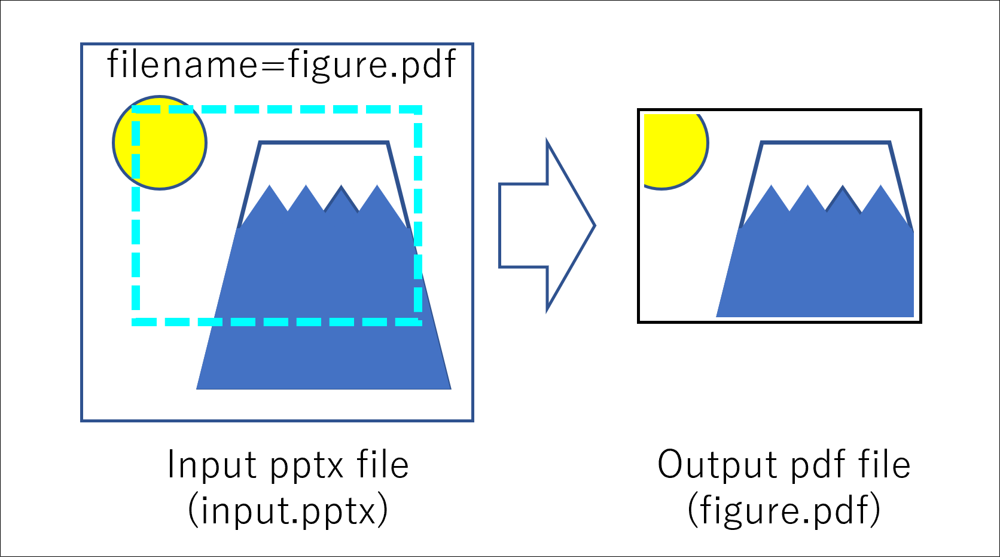
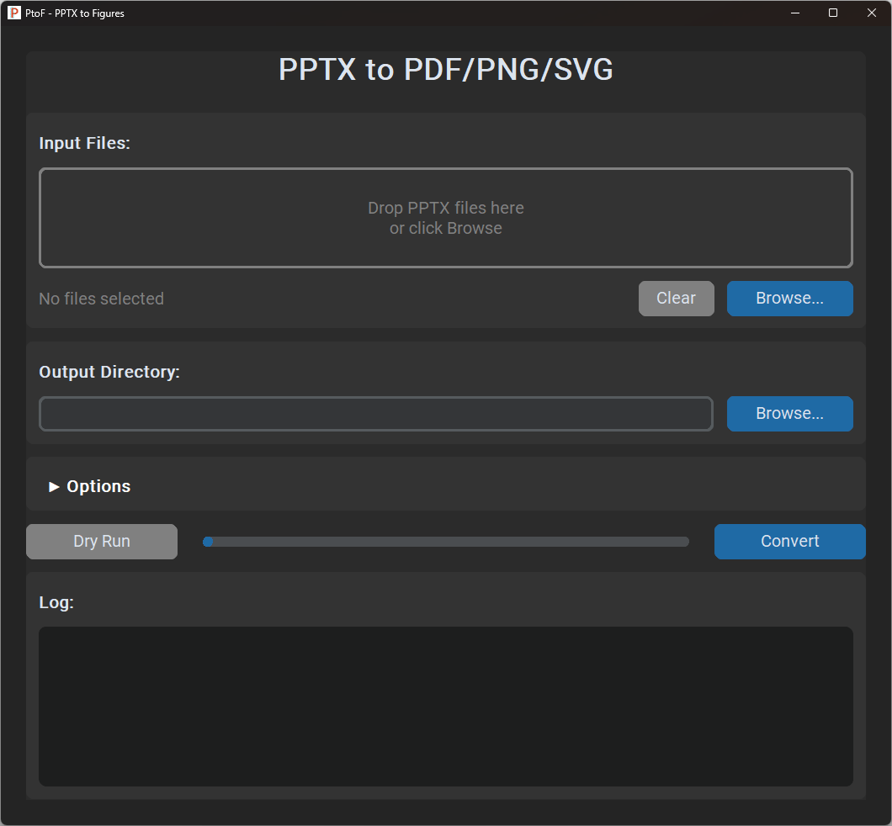
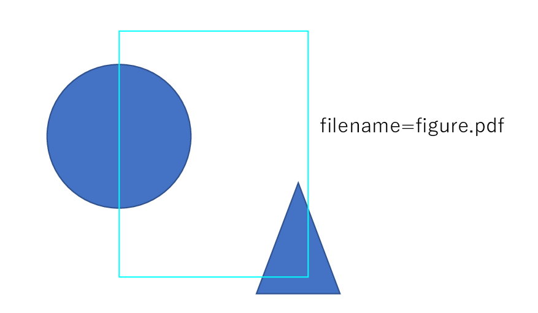

# PtoF - PPTX to Figures

A tool for extracting figures (PDF/PNG/SVG) from PowerPoint slides.

## Features


- Automatically detects regions marked with cyan (or custom color) rectangles
- Specify output filename with `filename=output.pdf`
- Multiple figures per slide supported (distance-based matching)
- PDF/PNG/SVG output formats
- GUI and CLI versions



## Installation

### Executable (Recommended)

Download `PtoF.exe` (GUI) or `PtoF_CLI.exe` (CLI) from [Releases](https://github.com/Yasuaki-Ito/ptof/releases).
* The executables are generated by PyInstaller.

> [!NOTE]
> On first launch, Windows SmartScreen may display a warning because the executable is not signed. Click "More info" → "Run anyway" to proceed.

### From Source

```bash
pip install -r requirements.txt
python ptof_gui.py  # GUI
python ptof.py input.pptx  # CLI
```

## Usage

### 1. Prepare your PPTX
<a href="sample/sample.pptx" download>
  📥 Sample pptx file (sample.pptx)
</a>

1. Draw a cyan rectangle around the region you want to extract. 
    * The color can be changed via CLI/GUI options.
2. Add a text box nearby with `filename=figure.pdf`
    * The location of the text box is flexible; the closest one will be used.
    * Supported formats: `.pdf`, `.png`, `.svg`




### 2. Convert

**GUI**: Drag & drop files → Click Convert

**CLI**:
```bash
ptof input.pptx
ptof input.pptx -o output/
ptof *.pptx --color red --dpi 600
```

## CLI Options

| Option | Description |
|--------|-------------|
| `-o, --output` | Output directory (default: output_dir) |
| `-c, --color` | Marker color (cyan, red, #FF0000, etc.) |
| `--dpi` | Resolution for PNG output (default: 300) |
| `--margin` | Margin in points (positive: expand, negative: shrink) |
| `--embed-fonts` | Force font embedding (PDF/A format) |
| `--dry-run` | Show detected regions without converting |
| `-n, --no-overwrite` | Confirm before overwriting |
| `-q, --quiet` | Suppress output |

## Requirements

- Windows + Microsoft PowerPoint
- Python 3.8+

## License

BSD-3-Clause License

## Additional Resources
An article introducing PtoF in Japanese is available on Zenn:
* [PowerPointで作った論文用の図を一発変換するWindowsアプリ「PtoF (PPTX to Figures)」をリリース](https://zenn.dev/comp_lab/articles/347a9cef4ddc23)
